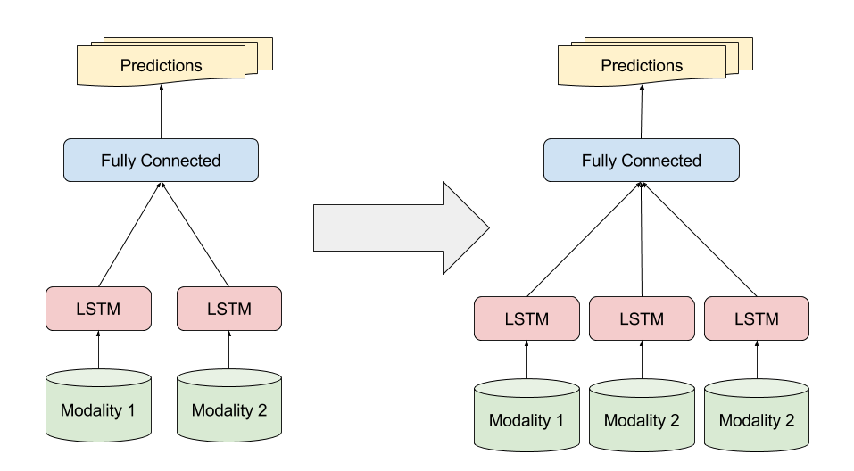

% Modular Deep Encoders-Decoder
% Huang, Qu, Shivakumar, Arnold
% \today

# Task

How to incrementally train a multi-modal discriminative model when a new
modality is included ?

# Problem Definition
We want to jointly learn a set of *encoder* functions $\{E_i\}_0^N$
mapping samples $x \sim \chi_i$ from a set of data distributions $\{\chi_i\}_0^N$ to a
fixed-sized vector embedding $V$.

$$ \forall i \in [0; N]: E_i(x): \chi_i \rightarrow V_i \in \Re^M$$

The embedding $V$ is then fed into a decoder function $D$ which learns a mapping to the label space
$L$.

$$ D(v): \Re^M \rightarrow L \in \Re^D$$

To handle the new modality, we train a new encoder $E_{N + 1}$ which will
modify $V$. We propose to use SGD solely on $E_{N+1}$, effectively
transfering the parameters of previous models.

# Experiment
Using the Arabic SaudiNews dataset, we built models to classify articles into
journals.
\break

SaudiNews Stats: 14 journals (ie, classes), 31'030 articles (about 50mb, 8.7M words), skewed prior distribution (52 vs 4.9k articles) 
\break

Modalities: Content, Title, Author ( + Date & URL)
\break

For those experiments, we trained our custom models using the *neon* deep
learning framework.
\break

# Preliminary Results

Same original model used for both representations.
\break
\break

## Learnt Matrix Embedding (word-level)

Train Accuracy: 96.51%

Validation Accuracy: 50.5%
\break

## Word2vec Embedding (sentence-level)

Train Accuracy: 95.96%

Validation Accuracy: 46.42%

# Future Work

Solve the overfitting problem. (hyper-params search ?)
\break

Code the custom backpropagation path for the new encoder.
\break

Train the augmented model.
\break

Compare with Author modality, which should provide almost perfect accuracy.
\break
